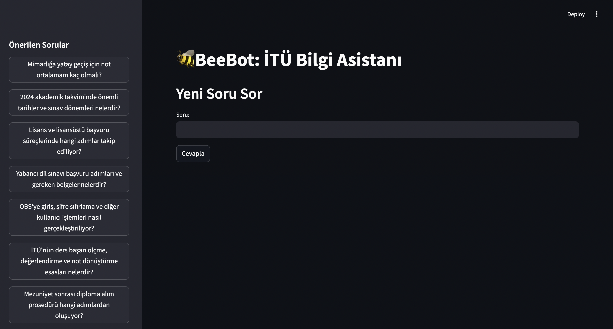

# BeeBot: İTÜ Bilgi Asistanı

BeeBot is an advanced Retrieval-Augmented Generation (RAG) powered assistant designed specifically for Istanbul Technical University (İTÜ) students. It provides accurate, context-aware answers to questions about university procedures, academic requirements, and campus resources.



## Features

- 🧠 Enhanced RAG system with double vector search retrieval
- 🔍 Hybrid search with different precision levels (alpha values)
- 🌐 Web search fallback when local knowledge is insufficient
- 💬 Natural language Turkish responses
- 📊 Transparent source attribution and confidence scoring
- 📖 Integration with İTÜ's knowledge base
- 🔄 Context visualization for educational purposes

## Technical Overview

BeeBot combines several advanced techniques:

- **Double Vector Retrieval**: Uses two different alpha values (0.75 and 0.5) to balance precision and recall
- **Context Sufficiency Analysis**: Analyzes whether retrieved documents contain sufficient information
- **Web Search Integration**: Falls back to web search when needed
- **LangGraph Workflow**: Uses a directed graph structure to orchestrate the RAG process
- **Weaviate Vector Database**: Stores and retrieves context-rich embeddings

## Installation

### Prerequisites

- Python 3.12+
- OpenAI API key
- Docker and Docker Compose (for containerized deployment)

### Option 1: Local Installation

1. Clone the repository:
   ```bash
   git clone https://github.com/yourusername/beebot.git
   cd beebot
   ```

2. Create a virtual environment:
   ```bash
   python -m venv venv
   source venv/bin/activate  # On Windows: venv\Scripts\activate
   ```

3. Install dependencies:
   ```bash
   pip install -r requirements.txt
   ```

4. Create a `.env` file:
   ```bash
   cp .env.example .env
   # Edit .env with your OpenAI API key and other settings
   ```

5. Start Weaviate (requires Docker):
   ```bash
   docker-compose up -d weaviate
   ```

6. Run the application:
   ```bash
   streamlit run app.py
   ```

### Option 2: Docker Deployment

1. Clone the repository:
   ```bash
   git clone https://github.com/yourusername/beebot.git
   cd beebot
   ```

2. Create a `.env` file:
   ```bash
   cp .env.example .env
   # Edit .env with your OpenAI API key
   ```

3. Build and start the containers:
   ```bash
   docker-compose up --build
   ```

4. Access the application at http://localhost:8501

## Usage

1. Open the application in your web browser
2. Select a suggested question from the sidebar or enter your own question
3. View the answer, along with source information and confidence score
4. Explore the context used to generate the answer for educational purposes

## Project Structure

```
beebot/
├── app.py                # Main Streamlit UI
├── agentstate.py         # State models and types
├── prompts.py            # LLM prompt templates
├── rag_graph.py          # LangGraph RAG workflow
├── tools.py              # Utilities and tools
├── vector_db.py          # Weaviate vector database operations
├── process_data.py       # Document processing and indexing
├── requirements.txt      # Python dependencies
├── Dockerfile            # Docker configuration
├── docker-compose.yml    # Service orchestration
├── entrypoint.sh         # Container startup script
├── .env.example          # Environment variables template
└── data/                 # Knowledge base data
    ├── raw/              # Raw text data
    ├── processed/        # Processed documents
    └── pdf_text/         # Extracted text from PDFs
```

## Configuration

Configuration is managed through environment variables:

| Variable | Description | Default |
|----------|-------------|---------|
| `OPENAI_API_KEY` | OpenAI API key | (required) |
| `RAW_DATA_DIR` | Path to raw data files | `data/raw` |
| `PROCESSED_DATA_DIR` | Path to processed data | `data/processed` |
| `PDF_TEXT_DIR` | Path to extracted PDF text | `data/pdf_text` |
| `WEAVIATE_HOST` | Weaviate host | `weaviate` |
| `WEAVIATE_PORT` | Weaviate port | `8080` |

## Modular Architecture

BeeBot is designed with a clean, modular architecture:

1. **Presentation Layer** (`app.py`): Streamlit UI for user interaction
2. **Business Logic Layer** (`rag_graph.py`): RAG graph workflow
3. **Data Access Layer** (`vector_db.py`): Weaviate database operations
4. **Data Processing Layer** (`process_data.py`): Document processing
5. **Utilities** (`tools.py`, `prompts.py`, `agentstate.py`): Support functionality

## License

-

## Acknowledgements

- Istanbul Technical University - ITU Perceptron Team
- Built with [Streamlit](https://streamlit.io/), [LangChain](https://langchain.com/), [Weaviate](https://weaviate.io/), and [OpenAI](https://openai.com/)